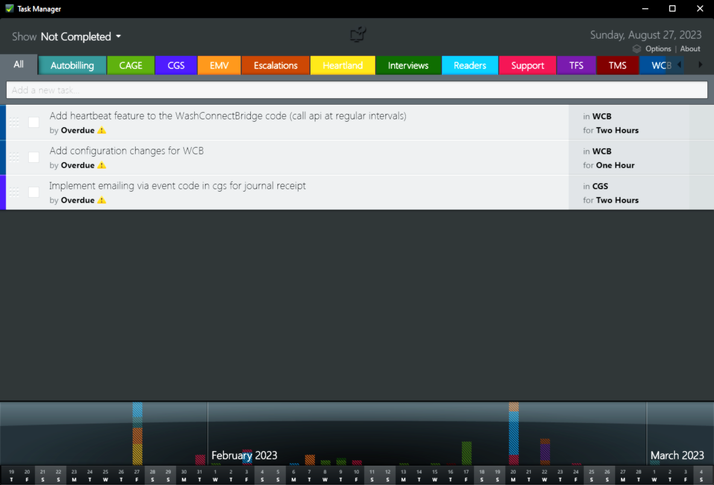

# 💻 WPF - Tasks.Show

### 📝 v1.0.1.5 - February 2022

* I do not remember where I got this original code, but I have reworked this entire project. I believe it was part of an old *Microsoft* WPF samples repo. If I had to guess I would say the original code write was around 2011.
* I had to refactor much of this code base as the `Task` object was not released at the time; that's how old it is! So naturally this caused the compiler much confusion once I updated the framework.
* I have updated the **.NET Framwork** to version `4.6.2`, but it could be taken to version `4.8` without issues.
* It uses the additional packages:
    - WindowsAPICodePack
    - PixelLab

## 🧾 License/Warranty
* Permission is hereby granted, free of charge, to any person obtaining a copy of this software and associated documentation files (the "Software"), to deal in the Software without restriction, including without limitation the rights to use, copy, modify, merge, publish and distribute copies of the Software, and to permit persons to whom the Software is furnished to do so, subject to the following conditions: The above copyright notice and this permission notice shall be included in all copies or substantial portions of the Software.
* The software is provided "as is", without warranty of any kind, express or implied, including but not limited to the warranties of merchantability, fitness for a particular purpose and noninfringement. In no event shall the author or copyright holder be liable for any claim, damages or other liability, whether in an action of contract, tort or otherwise, arising from, out of or in connection with the software or the use or other dealings in the software.
* Copyright © 2022–2023. All rights reserved.

## 📋 Proofing
* This application was compiled and tested using *VisualStudio* 2022 on *Windows 10* versions **22H2**, **21H2** and **21H1**.
